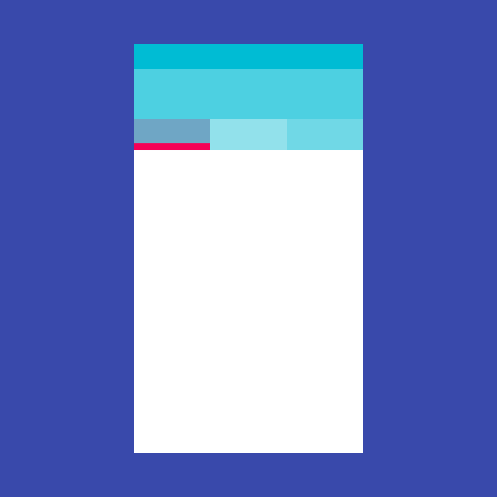

# App 结构和导航

## 目录

| 名称 | 效果图 | 说明  |
|:----:|:------:|:---:|
| Scaffold   |  | MD 布局结构的基本实现。此类提供了用于显示 drawer、snackbar 和底部 sheet 的 API。[\[文档\]](https://api.flutter.dev/flutter/material/Scaffold-class.html) |
| Appbar   |  | 一个 Material Design 应用程序栏，由工具栏和其他可能的 widget（如 TabBar 和 FlexibleSpaceBar）组成。[\[文档\]](https://docs.flutter.io/flutter/material/AppBar-class.html) |
| BottomNavigationBar   |  | 底部导航条，可以很容易地在 tap 之间切换和浏览顶级视图。[\[文档\]](https://api.flutter.dev/flutter/material/BottomNavigationBar-class.html) |
| TabBar   |  | 一个显示水平选项卡的 Material Design widget。[\[文档\]](https://docs.flutter.io/flutter/material/TabBar-class.html) |
| TabBarView   |  | 显示与当前选中的选项卡相对应的页面视图。通常和 TabBar 一起使用。[\[文档\]](https://docs.flutter.io/flutter/material/TabBarView-class.html)  |
| MaterialApp  |  | 一个方便的 widget，它封装了应用程序实现 Material Design 所需要的一些 widget。[\[文档\]](https://docs.flutter.io/flutter/material/MaterialApp-class.html)  |
| WidgetsApp |  | 一个方便的类，它封装了应用程序通常需要的一些 widget。[\[文档\]](https://docs.flutter.io/flutter/widgets/WidgetsApp-class.html)  |
| Drawer   |  | 从 Scaffold 边缘水平滑动以显示应用程序中导航链接的 Material Design 面板。[\[文档\]](https://docs.flutter.io/flutter/material/Drawer-class.html) |